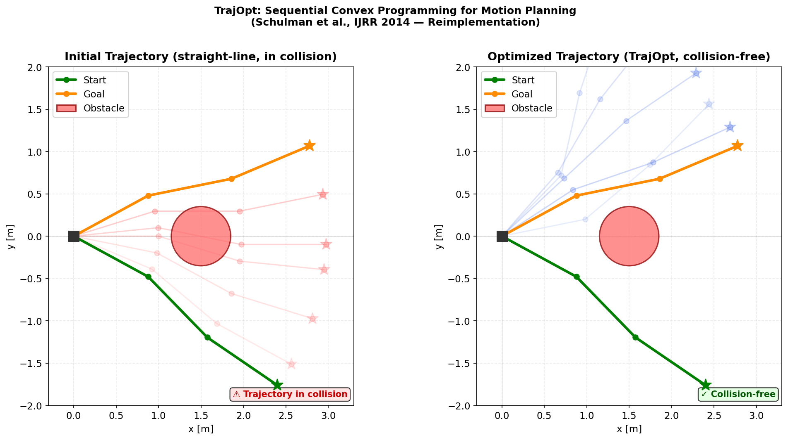
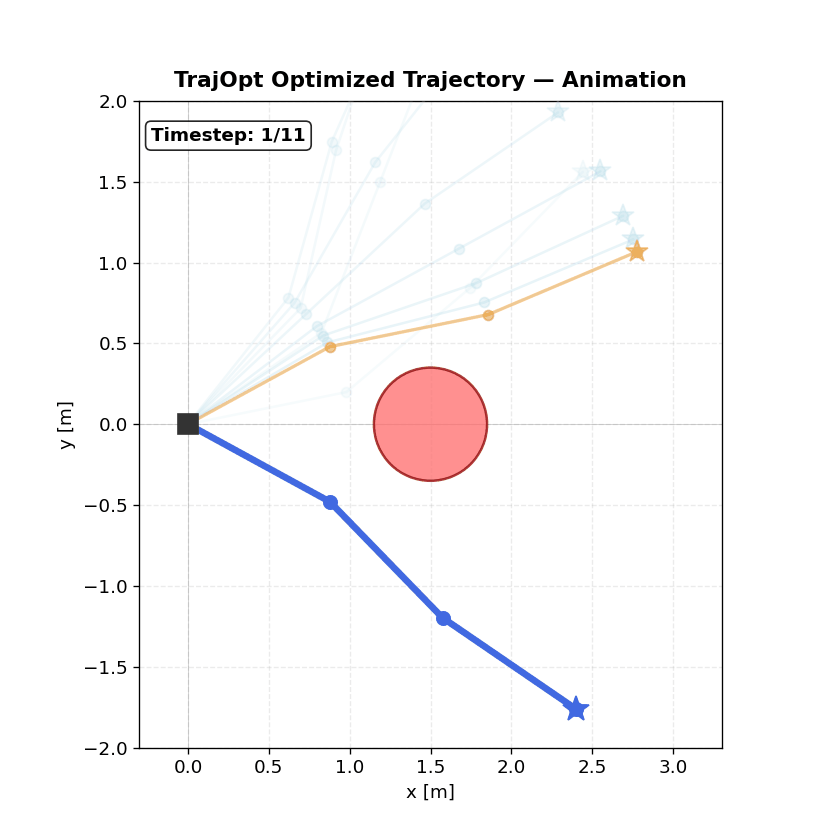
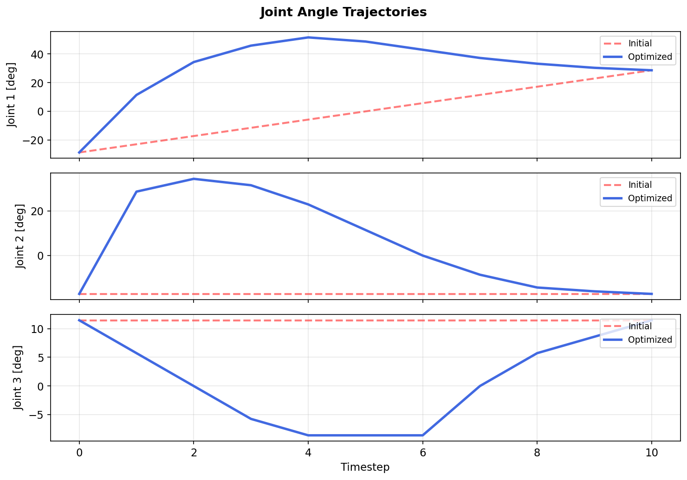

# TrajOpt Reimplementation (C++17)

A ground-up C++17 implementation of the trajectory optimization algorithm from:

> Schulman et al., *"Motion Planning with Sequential Convex Optimization and Convex Collision Checking"*, IJRR 2014.

This project implements optimization-based motion planning from first principles and investigates the robustness of collision constraint handling in sequential convex programming.

---

## Motivation

Trajectory optimization is fundamentally a **non-convex constrained optimization problem**.

TrajOpt addresses this via:

- Sequential convexification (SQP)
- ℓ1 exact penalty method
- Trust-region globalization
- Signed-distance linearization

During reimplementation, I encountered a critical issue:

> If the linearized collision constraint does not depend on the current iterate \( x \), the SQP solver cannot push the trajectory out of collision.

In an early version, the collision constraint value was mistakenly treated as constant with respect to the optimization variable. This prevented proper feasibility restoration.

Fixing this required:

- Re-deriving the signed-distance linearization
- Correctly constructing \( sd(q) ≈ sd_0 + g^T(q - q_0) \)
- Ensuring the constraint function depends on the current iterate
- Verifying convergence behavior under trust-region and penalty updates

This project evolved from a reimplementation into a study of **robust constraint linearization in optimization-based motion planning**.

---

## What's Implemented

### 1. SE(3) Lie Group Math (`include/robot/se3.hpp`)

Full implementation of SE(3) operations for manifold optimization:

- `hat` / `vee` operators (ℝ⁶ ↔ se(3))
- `exp_se3` / `log_se3` (Rodrigues’ formula)
- `retract` / `local_diff`
- `pose_error` for end-effector equality constraints

```cpp
SE3 X_new = retract(X, delta);
Twist delta = local_diff(X, Y);
```

All operations are implemented analytically (no Euler angle approximations).

---

### 2. GJK Collision Detection (`include/collision/gjk.hpp`)

From-scratch implementation of the **Gilbert-Johnson-Keerthi algorithm**:

- Distance queries between convex shapes
- Support functions: sphere, box, capsule
- Convex hull support for swept-volume checking (Eq. 22)
- No explicit mesh representation required

---

### 3. Signed Distance Linearization (`include/collision/signed_distance.hpp`)

Core linearization enabling QP-based collision avoidance:

\[
sd(q) ≈ sd_0 + g^T (q - q_0)
\]

- Discrete-time collision checking
- Continuous-time swept volume checking (convex hull of consecutive poses)
- ℓ1 hinge loss: \( |d_{safe} - sd|_+ \)

The linearized constraint is correctly constructed as:

\[
d_{safe} - (sd_0 + g^T(q - q_0)) \le 0
\]

ensuring feasibility restoration in SQP iterations.

---

### 4. Robot Arm Kinematics (`include/robot/arm.hpp`)

- Standard DH parameterization
- Forward kinematics via homogeneous transforms
- Analytical geometric Jacobian
- Joint limit handling
- Factory models: Panda-like 7DOF arm, 3DOF planar arm

---

### 5. SQP Solver (`include/scp/solver.hpp`)

Implementation of Algorithm 1 (ℓ1 penalty SQP):

```
for penalty iteration:
    for convexification iteration:
        build QP via linearization
        solve QP
        accept/reject via trust region
    if constraint violated:
        increase μ
```

Design features:

- ℓ1 exact penalty (not ℓ2)
- Trust region as box constraint
- Merit function evaluation
- Feasibility restoration via penalty scaling

---

### 6. Full Trajectory Optimization (`include/scp/trajopt.hpp`)

- Path length objective
- Start/goal constraints
- Joint limits
- Optional end-effector pose constraint
- Collision constraints re-linearized each iteration

---

## Demo: 3-Link Planar Arm

A 3-DOF planar arm avoids two box obstacles and one sphere obstacle.

The straight-line initialization passes through obstacles.  
After correct constraint linearization, the optimizer finds a collision-free trajectory.

---

### Initial vs Optimized Trajectory



Left: straight-line interpolation (in collision)  
Right: optimized trajectory (collision-free)

---

### Animated Motion



---

### Joint Angle Profiles



The optimized trajectory shows smooth joint transitions while satisfying collision constraints.

---

## Building

```bash
mkdir build && cd build
cmake .. -DCMAKE_BUILD_TYPE=Release
make -j$(nproc)
```

Run tests:

```bash
ctest --output-on-failure
```

Run demo:

```bash
./arm_2d_demo
python3 ../python/visualize.py trajectory_data.json
```

---

## Architecture

```
include/
├── robot/
│   ├── se3.hpp
│   └── arm.hpp
├── collision/
│   ├── gjk.hpp
│   └── signed_distance.hpp
└── scp/
    ├── solver.hpp
    └── trajopt.hpp
```

---

## Limitations

- QP solver uses projected gradient descent (not OSQP/interior-point)
- EPA not implemented (penetration depth is approximate)
- No self-collision handling
- Only primitive convex shapes supported
- Sensitive to initialization (expected for non-convex problems)

---

## What I Learned

- Constraint linearization must depend on the current iterate.
- ℓ1 exact penalties guarantee feasibility in the limit but require careful tuning of μ.
- Trust region scaling critically affects convergence stability.
- Continuous-time collision checking via convex hull support elegantly prevents tunneling.
- Geometry and optimization are deeply coupled: collision normals shape the optimization landscape.

---

## References

- Schulman et al., IJRR 2014  
- Gilbert, Johnson, Keerthi (1988)  
- Murray, Li, Sastry (1994)  
- Blanco (2010)  
- Nocedal & Wright (1999)